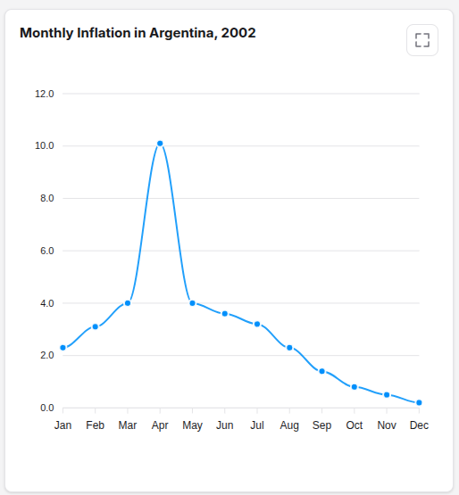
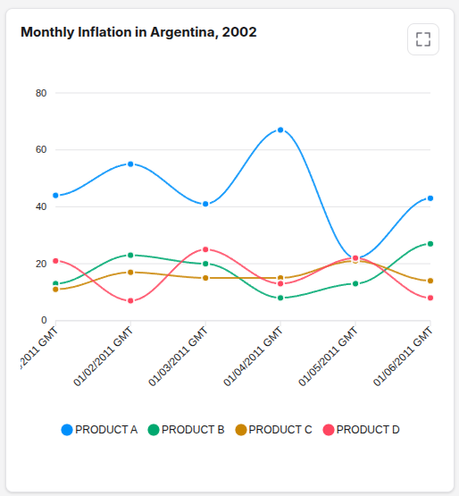

# Line

```json
     {
            "id": "monthly_inflation_line",
            "type": "line",
            "title": {
                "en": "Monthly Inflation in Argentina, 2002",
                "es": "Inflación mensual en Argentina, 2002"
            },
            "data": [2.3, 3.1, 4.0, 10.1, 4.0, 3.6, 3.2, 2.3, 1.4, 0.8, 0.5, 0.2],
            "categories": {
                            "en":["Jan","Feb","Mar","Apr","May","Jun","Jul","Aug","Sep","Oct","Nov","Dec"],
                            "es":["Ene","Feb","Mar","Abr","May","Jun","Jul","Ago","Sep","Oct","Nov","Dic"]
                        }
        
        }

```


```json
        {
            "id": "product_comparison_line",
            "type": "line",
            "title": {
                "en": "Monthly Inflation in Argentina, 2002",
                "es": "Inflación mensual en Argentina, 2002"
            },
            "series": [
                {
                "name": {
                    "en":"PRODUCT A",
                    "es":"PRODUCTO A"
                },
                "data": [44, 55, 41, 67, 22, 43]
                },
                {
                "name": {
                    "en":"PRODUCT B",
                    "es":"PRODUCTO B"
                },
                "data": [13, 23, 20, 8, 13, 27]
                },
                {
                "name": {
                    "en":"PRODUCT C",
                    "es":"PRODUCTO C"
                },
                "data": [11, 17, 15, 15, 21, 14]
                },
                {
                "name": {
                    "en":"PRODUCT D",
                    "es":"PRODUCTO D"
                },
                "data": [21, 7, 25, 13, 22, 8]
                }
            ],
            "categories":{
                "en": ["01/01/2011 GMT","01/02/2011 GMT","01/03/2011 GMT","01/04/2011 GMT","01/05/2011 GMT","01/06/2011 GMT"],
                "es": ["01/01/2011 GMT","01/02/2011 GMT","01/03/2011 GMT","01/04/2011 GMT","01/05/2011 GMT","01/06/2011 GMT"]
            }
        }
```

