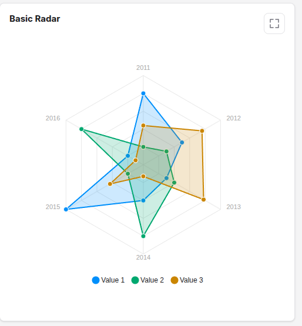

# Radar

```json
 {
            "id": "value_comparison_radar",
            "type": "radar",
            "title": {
                "en": "Basic Radar",
                "es": "Radar Básico"
            },
            "categories": {
                "en":["2011", "2012", "2013", "2014", "2015", "2016"],
                "es":["2011", "2012", "2013", "2014", "2015", "2016"]
            },
            "series": [
                {
                "name": {
                    "en":"Value 1",
                    "es":"Valor 1"
                },
                "data": [80, 50, 30, 40, 100, 20]
                },
                {
                "name": {
                    "en":"Value 2",
                    "es":"Valor 2"
                },
                "data": [20, 30, 40, 80, 20, 80]
                },
                {
                "name": {
                    "en":"Value 3",
                    "es":"Valor 3"
                },
                "data": [44, 76, 78, 13, 43, 10]
                }
            ]
        }
```

