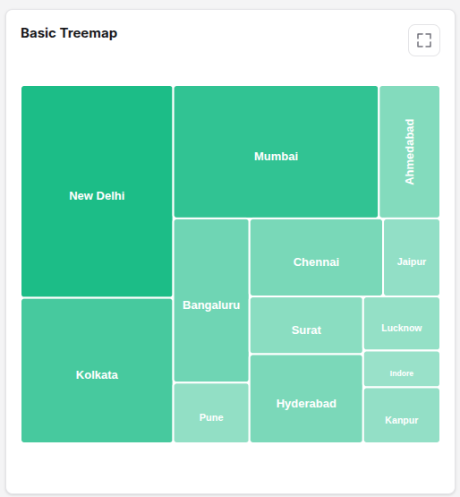

# Tree Map


```json
        {
            "id": "city_values_treemap",
            "type": "treemap",
            "title": {
                "en": "Basic Treemap",
                "es": "Mapa de Árbol Básico"
            },
            "data": [
        {
          "x": {
            "en":"New Delhi",
            "es":"Nueva Delhi"
          },
          "y": 218
        },
        {
          "x": {
            "en":"Kolkata",
            "es":"Calcuta"
          },
          "y": 149
        },
        {
          "x": {
            "en":"Mumbai",
            "es":"Bombay"
          },
          "y": 184
        },
        {
          "x": {
            "en":"Ahmedabad",
            "es":"Ahmedabad"
          },
          "y": 55
        },
        {
          "x": {
            "en":"Bangaluru",
            "es":"Bangaluru"
          },
          "y": 84
        },
        {
          "x": {
            "en":"Pune",
            "es":"Pune"
          },
          "y": 31
        },
        {
          "x": {
            "en":"Chennai",
            "es":"Chennai"
          },
          "y": 70
        },
        {
          "x": {
            "en":"Jaipur",
            "es":"Jaipur"
          },
          "y": 30
        },
        {
          "x": {
            "en":"Surat",
            "es":"Surat"
          },
          "y": 44
        },
        {
          "x": {
            "en":"Hyderabad",
            "es":"Hyderabad"
          },
          "y": 68
        },
        {
          "x": {
            "en":"Lucknow",
            "es":"Lucknow"
          },
          "y": 28
        },
        {
          "x": {
            "en":"Indore",
            "es":"Indore"
          },
          "y": 19
        },
        {
          "x": {
            "en":"Kanpur",
            "es":"Kanpur"
          },
          "y": 29
        }
      ]
        }
```

