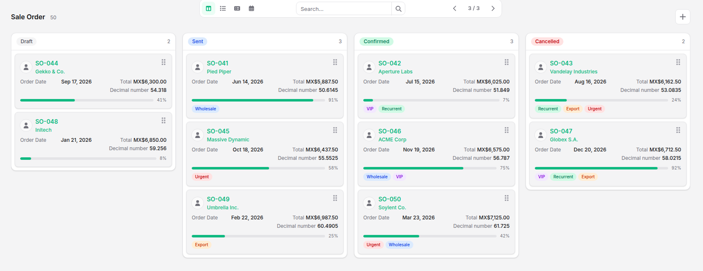
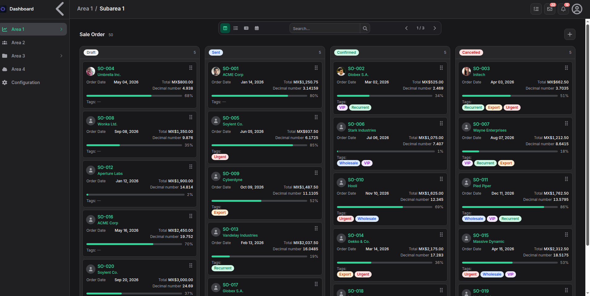
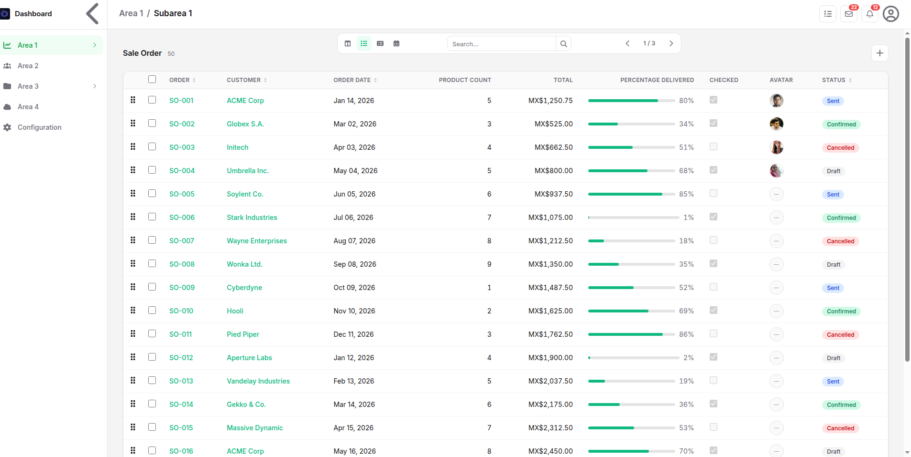
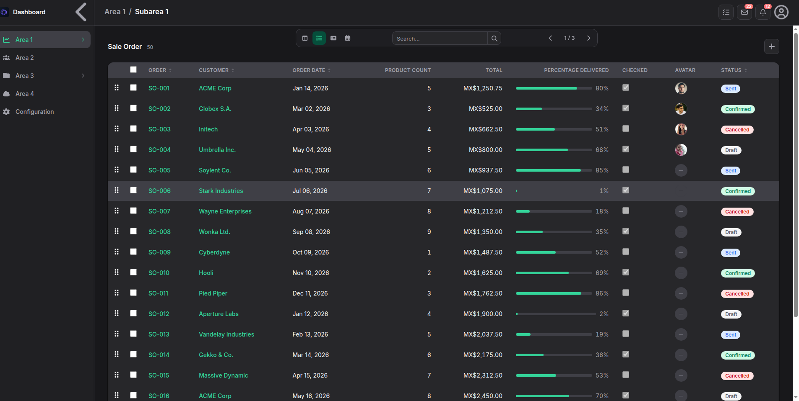
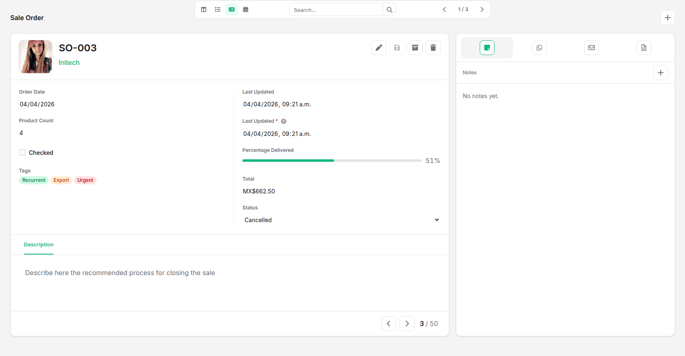
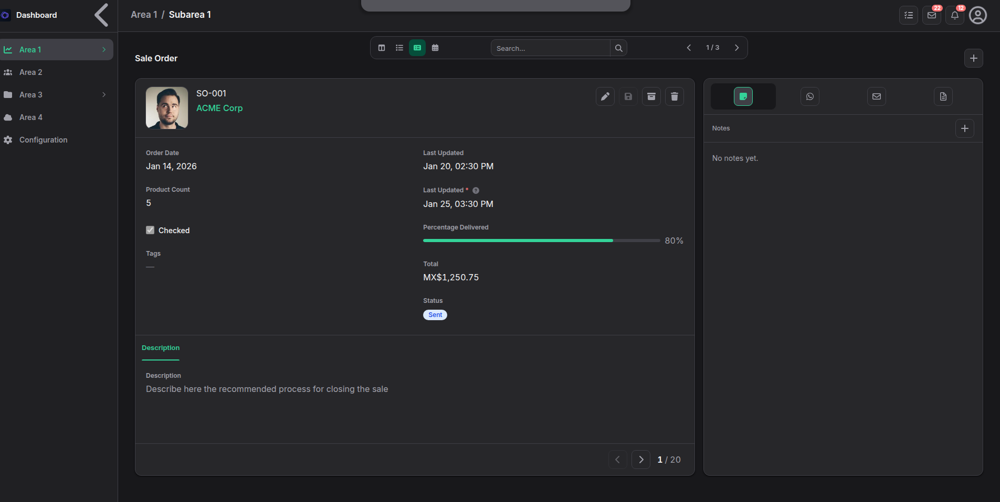
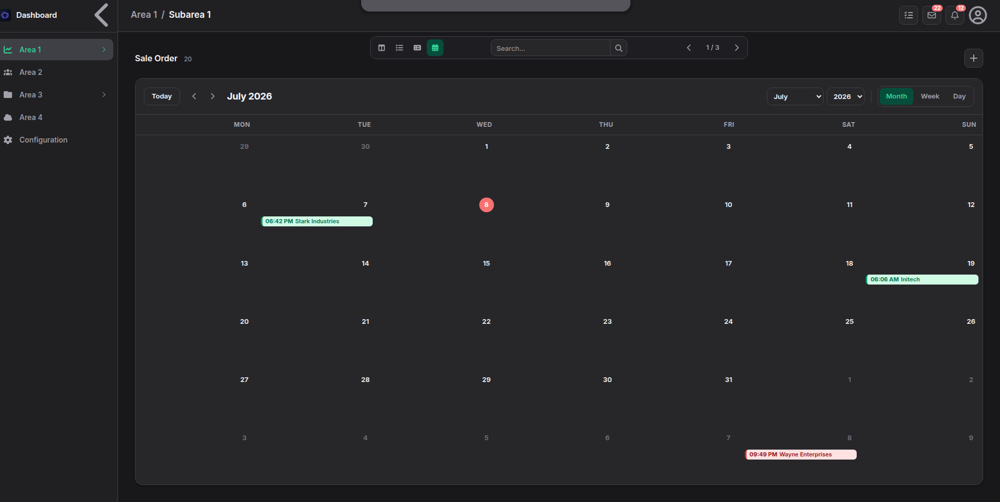
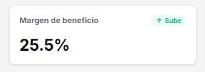

# Views Format 

## Data visualization type

- string
- integer
- decimal
- monetary
- percentage
- date
- datetime
- boolean
- color
- image
- text
- password
- selection
- status_badge
- html
- json
- many2one
- many2one_avatar
- one2many
- oney2many_kanban
- one2many_list
- many2many
- many2many_pills


## Schema

The schema defines the visualization of each field in its kanban, list, form, and calendar formats.

```json
{
    "schema":[
        {
            "name": "", 
            "type": "",
            "label": {
                "es": "",
                "en": ""
            },
            "kanban":{}, 
            "list":{},
            "form":{},
            "calendar":{}
        }
    ]
}
```

### name
The name of the field that will be used in the views.
### type
The type of display is taken from the field definition in system.model.field
### label
The name that will appear as a reference to that field in the views
## Kanban

Grouping is configured at model level. `groupBy` contains the record field name,
and the property with that name contains the available groups. If `groupBy` is
omitted, cards are displayed without grouping even when group values exist.

```json
{
    "groupBy": "status",
    "status": [
        { "value": "draft", "en": "Draft", "es": "Borrador", "color": "zinc" },
        { "value": "confirmed", "en": "Confirmed", "es": "Confirmada", "color": "green" }
    ]
}
```

The Kanban view consists of 4 areas:
### Header
It has 3 sections where only one field is allowed:
1. image: For avatar or logo, located on the left.If the schema does not mention an image, it is not rendered.

2. title: For the card title.

3. subtitle: Located below the title in smaller font.
### rightColumn
Right column within the Kanban card body. Fields are ordered one below the other, defining their position with an integer index starting from 0.
### leftColumn
Left column within the Kanban card body. Fields are ordered one below the other, defining their position with an integer index starting from 0.
### footer
Fields are ordered in descending order across the width of the Kanban card.

```json
{
    "kanban":{
        "header":"image|title|subtitle",
        "rightColumn":1,
        "leftColumn":1,
        "footer":1
    }
}
```





## List

The `list` object includes a field as a column in the list view.

- `column`: integer that defines the column position. Columns are rendered from
  the lowest value to the highest value.
- `order`: enables sorting for the column.
  - `true`: displays the sorting control without applying an initial order.
  - `"asc"`: displays the sorting control and initially sorts the records in
    ascending order.
  - `"desc"`: displays the sorting control and initially sorts the records in
    descending order.

Only one field per schema should declare an initial `"asc"` or `"desc"` order.
The user can click the sorting control to alternate between ascending and
descending order.

Sortable column without an initial order:

```json
{
    "list": {
        "column": 7,
        "order": true
    }
}
```

Date column with the newest records first:

```json
{
    "name": "date",
    "type": "datetime",
    "label": {
        "es_MX": "Fecha",
        "en_US": "Date"
    },
    "list": {
        "column": 3,
        "order": "desc"
    }
}
```

If `list` is omitted, or its value is `false`, the field is not displayed in
the list view.





## Form

The form view consists of four areas:

1. `header`: accepts one `image`, one `title`, and one `subtitle` field. The image is always rendered on the left and is omitted completely when no schema field declares `"header": "image"`.
2. `leftColumn`: fields in the left body column, ordered by an integer index starting at `0`.
3. `rightColumn`: fields in the right body column, ordered by an integer index starting at `0`.
4. `tab`: groups fields into tabs. The integer selects and orders the tab; the first field label is used as its title.

Each field must declare only one placement. `required`, `readonly`, `placeholder`, and `help` can be combined with any placement.

```json
{
    "form": {
        "header": "image|title|subtitle",
        "rightColumn": 1,
        "leftColumn": 1,
        "tab": 0,
        "required": true,
        "readonly": true,
        "placeholder": {
            "en": "",
            "es": ""
        },
        "help": {
            "en": "",
            "es": ""
        }
    }
}
```

```json
{
    "name": "settings_ids",
    "type": "one2many",
    "label": {
        "es_MX": "Configuraciones",
        "en_US": "Settings"
    },
    "form": {
        "tab": 2,
        "view": "one2many_list",
        "function":[
            {
                "name": "description",
                "type": "count",
                "label": {
                    "es_MX": "Total",
                    "en_US": "Total"
                }
            }
        ],
        "list_view": [
            {
                "name": "name",
                "type": "string",
                "label": {
                    "es_MX": "Clave",
                    "en_US": "Key"
                }
            },
            {
                "name": "description",
                "type": "string",
                "label": {
                    "es_MX": "Descripción",
                    "en_US": "Description"
                }
            }
        ],
        "placeholder": {
            "es_MX": "Configuraciones",
            "en_US": "Settings"
        },
        "help": {
            "es_MX": "Configuraciones de la aplicación",
            "en_US": "App settings"
        }
    }
}
```





### Followers

Every record can be followed by users by default. Followers are not declared in
the model schema JSON; the platform adds the followers widget automatically to
the left side of the form footer.

The widget displays human and AI-agent users only. System users are excluded.

### one2many_kanban

Any relational field (`one2many`, `one2many_pills`, etc.) can render its related
records as mini-kanban cards instead of its default control by setting
`"view": "one2many_kanban"` in its `form` config. `kanban_view.header` maps each
card slot to a property name read directly off each related record — it does
not reference schema fields.

1. `image`: URL for the avatar, shown left of the title. Omitted entirely when
   not declared; if declared but the record has no value, an icon placeholder
   is shown instead — same as the [Kanban](#header) header image.
2. `title`: card title, to the right of the image.
3. `subtitle`: shown below the title, in smaller/muted text.

If a related record has a `color` property, the card border is colored using
the same palette as the [Color](#data-visualization-type) field type — see the
regular Kanban view's accent-border behavior.

```json
{
    "form": {
        "tab": 0,
        "view": "one2many_kanban",
        "kanban_view": {"header": {"image": "avatar_url", "title": "name", "subtitle": "email"}},
        "placeholder": {
            "es_MX": "Usuarios",
            "en_US": "Users"
        },
        "help": {
            "es_MX": "Usuarios asociados",
            "en_US": "Associated users"
        }
    }
}
```

## Calendar

The three options are assigned to fields in the model schema. An event is
rendered only when its `startDate` field contains a valid date. If `endDate` is
empty or invalid, the event lasts 30 minutes. Event text starts with the start
time followed by the configured title.

```json
{
    "calendar":{
        "startDate":true,
        "endDate":true,
        "title":true
    }
}
```




## Insight

### kpis
EWS_FORMAT.MD?
- value: number
- unit: any
- trend: up|down

```json
 {
    "id": "profit_margin",
    "name":{
        "en": "Profit margin",
        "es": "Margen de beneficio"
    },
    "value": 25.5,
    "unit": "%",
    "trend": "up"
}
```


### gauges

```json
{
            "id": "operational_efficiency",
            "name":{
                "en": "Operational Efficiency",
                "es": "Eficiencia Operativa"
            },
            "value": 78,
            "unit": "%",
            "max": 100,
            "thresholds": {
                "green": 80,
                "yellow": 60,
                "red": 0
            }
        }
```


### graphics

1. [Bar](./BAR.md).
2. [Line](./LINE.md).
3. [Donut](./DONUT.md).
4. [Tree Map](./TREEMAP.md).
5. [Radar](./RADAR.md).
6. [Heat Map](./HEATMAP.md).
7. [Sankey](./SANKEY.md).

The Insight view renders the `kpis`, `gauges`, and `graphics` collections. Each
element is linked to the DOM or its chart instance using the `id` defined
in the data format. Value changes preserve the container and update
only the corresponding element; structural changes rebuild
the view. See [DATA_FORMAT.md](./DATA_FORMAT.md#reactive-updates)
for the schema and available actions.
