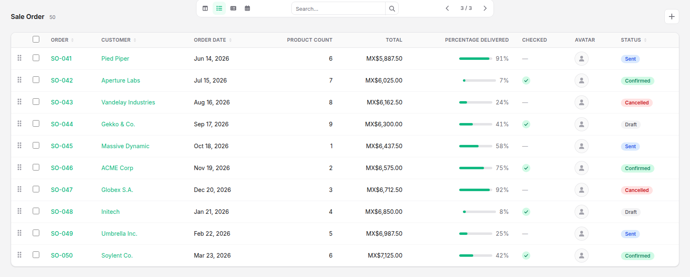
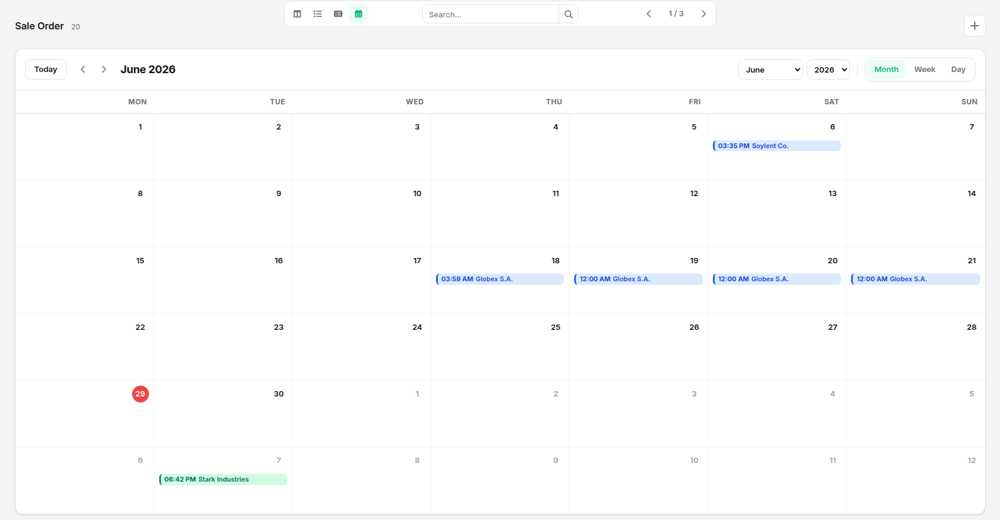
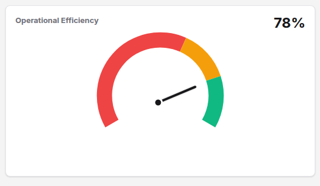

# Views Format 

## Data visualization type

- string
- integer
- decimal
- monetary
- percentage
- date
- datetime
- boolean
- image
- text
- html
- many2one
- many2one_avatar
- one2many
- many2many
- many2many_pills
- many2many_kanban
- many2many_list
- model_followers


## Schema
```json
{
    "schema":[
        {
        "name":"field_name",
        "type":"Data visualization type",
        "label":{
            "en":"Description",
            "es":"Descripción"
        },
        "groupBy":"field",
        "field": [],
        "kanban":{},
        "list":{},
        "form":{},
        "calendar":{}
        }
    ]
}
```

## Kanban

Grouping is configured at model level. `groupBy` contains the record field name,
and the property with that name contains the available groups. If `groupBy` is
omitted, cards are displayed without grouping even when group values exist.

```json
{
    "groupBy": "status",
    "status": [
        { "value": "draft", "en": "Draft", "es": "Borrador", "color": "zinc" },
        { "value": "confirmed", "en": "Confirmed", "es": "Confirmada", "color": "green" }
    ]
}
```

The Kanban view consists of 4 areas:
### Header
It has 3 sections where only one field is allowed:
1. image: For avatar or logo, located on the left.

2. title: For the card title.

3. subtitle: Located below the title in smaller font.
### rightColumn
Right column within the Kanban card body. Fields are ordered one below the other, defining their position with an integer index starting from 0.
### leftColumn
Left column within the Kanban card body. Fields are ordered one below the other, defining their position with an integer index starting from 0.
### footer
Fields are ordered in descending order across the width of the Kanban card.

```json
{
    "kanban":{
        "header":"image|title|subtitle",
        "rightColumn":1,
        "leftColumn":1,
        "footer":1
    }
}
```


## List

```json
{
    "list": {
                    "column":7
                },
}
```


## Form

The form view consists of four areas:

1. `header`: accepts one `image`, one `title`, and one `subtitle` field. The image is always rendered on the left and is omitted completely when no schema field declares `"header": "image"`.
2. `leftColumn`: fields in the left body column, ordered by an integer index starting at `0`.
3. `rightColumn`: fields in the right body column, ordered by an integer index starting at `0`.
4. `tab`: groups fields into tabs. The integer selects and orders the tab; the first field label is used as its title.

Each field must declare only one placement. `required`, `readonly`, `placeholder`, and `help` can be combined with any placement.

```json
{
    "form": {
        "header": "image|title|subtitle",
        "rightColumn": 1,
        "leftColumn": 1,
        "tab": 0,
        "required": true,
        "readonly": true,
        "placeholder": {
            "en": "",
            "es": ""
        },
        "help": {
            "en": "",
            "es": ""
        }
    }
}
```


## Calendar

The three options are assigned to fields in the model schema. An event is
rendered only when its `startDate` field contains a valid date. If `endDate` is
empty or invalid, the event lasts 30 minutes. Event text starts with the start
time followed by the configured title.

```json
{
    "calendar":{
        "startDate":true,
        "endDate":true,
        "title":true
    }
}
```


## Insight

### kpis
EWS_FORMAT.MD?
- value: number
- unit: any
- trend: up|down

```json
 {
    "id": "profit_margin",
    "name":{
        "en": "Profit margin",
        "es": "Margen de beneficio"
    },
    "value": 25.5,
    "unit": "%",
    "trend": "up"
}
```


### gauges

```json
{
            "id": "operational_efficiency",
            "name":{
                "en": "Operational Efficiency",
                "es": "Eficiencia Operativa"
            },
            "value": 78,
            "unit": "%",
            "max": 100,
            "thresholds": {
                "green": 80,
                "yellow": 60,
                "red": 0
            }
        }
```


### graphics

1. [Bar](./BAR.md).
2. [Line](./LINE.md).
3. [Donut](./DONUT.md).
4. [Tree Map](./TREEMAP.md).
5. [Radar](./RADAR.md).
6. [Heat Map](./HEATMAP.md).
7. [Sankey](./SANKEY.md).

The Insight view renders the `kpis`, `gauges`, and `graphics` collections. Each
element is linked to the DOM or its chart instance using the `id` defined
in the data format. Value changes preserve the container and update
only the corresponding element; structural changes rebuild
the view. See [DATA_FORMAT.md](./DATA_FORMAT.md#reactive-updates)
for the schema and available actions.
